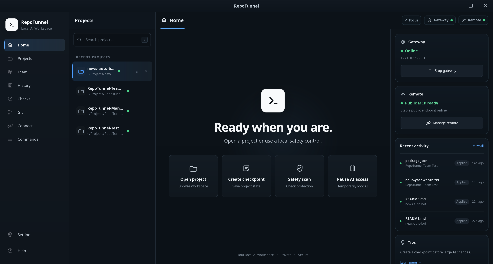

# RepoTunnel

RepoTunnel is a local-first bridge that lets MCP-compatible AI clients work directly with the projects you explicitly approve on your computer.

Instead of copying code between chat, your editor, terminal, Git, and browser, RepoTunnel connects those tools through one controlled workspace. The AI can inspect, edit, test, debug, and help complete real project work while RepoTunnel keeps access limited to the project and permissions you choose.



## Why RepoTunnel

AI coding is most useful when it can work with the actual project instead of isolated snippets. RepoTunnel gives the AI that access without giving it unrestricted access to your computer.

With RepoTunnel, an AI can:

- Work only inside projects you explicitly approve.
- Read, create, edit, rename, move, and delete project files.
- Search and understand project structure.
- Run builds, tests, package commands, development servers, and managed processes.
- Inspect Git status, branches, diffs, and recent commits.
- Stage and commit validated changes.
- Push to Git only when you explicitly ask for a push.
- Launch supported applications and project URLs.
- Use a managed browser to test web applications.
- Navigate pages, click, type, scroll, reload, capture screenshots, and inspect browser errors.
- Use an isolated AI Workspace for supported desktop applications without taking over your normal desktop session.
- Keep project monitoring, change history, and recovery information available during longer AI work.
- Use Team Mode when two AI engineers should collaborate on the same project.

## Work modes

### AI Auto

AI Auto allows compatible project work to continue without repeated RepoTunnel approval prompts.

Security boundaries still remain active. AI Auto does not grant unrestricted filesystem access, disable sandboxing, or give standing permission to push Git changes.

### AI Review

AI Review keeps supported changes and actions waiting for local approval before they are applied.

Use it when you want to inspect changes more closely while still allowing the AI to work directly with the project.

## AI Workspace

AI Workspace provides an isolated virtual desktop for supported applications.

It allows the AI to work inside an approved desktop application without stealing focus from your normal desktop. This is useful for editors, development tools, productivity applications, and other supported GUI workflows.

The normal RepoTunnel file, terminal, process, browser, and project methods remain available as fallback paths where appropriate.

## Team Mode

Team Mode connects two persistent AI engineers to the same approved project.

The engineers divide meaningful implementation work into non-overlapping tasks, work in parallel, cross-review each other's changes, test the result, and verify the requested work before completing the current task.

The Team stays attached to the project so later requests can continue without recreating the collaboration session each time.

## Install

Download RepoTunnel from the official GitHub Releases page:

**https://github.com/Yashwanth034/RepoTunnel/releases/latest**

| Platform | Package |
| --- | --- |
| Windows x64 | `.exe` or `.msi` |
| macOS Apple Silicon | `aarch64.dmg` |
| macOS Intel | `x64.dmg` |
| Debian / Ubuntu / Linux Mint | `.deb` |
| Fedora / RHEL compatible | `.rpm` |
| Other supported x86_64 Linux systems | AppImage |

Each release includes `RepoTunnel-SHA256SUMS.txt` so downloaded installers can be verified before use. Release notes and older versions are available on the GitHub Releases page.

## Setup

### 1. Add a project

Open RepoTunnel and either:

- select an existing local project folder, or
- clone a GitHub repository directly.

RepoTunnel limits AI access to the projects you explicitly approve.

### 2. Choose a work mode

Choose the mode you want for that project:

- **AI Auto** — compatible project work can proceed without repeated approval prompts.
- **AI Review** — supported changes and actions wait for your local approval.

The same project security boundaries remain active in both modes.

### 3. Configure the public connection

For the normal setup, use RepoTunnel's built-in ngrok connection.

1. Create or sign in to an ngrok account:
   **https://dashboard.ngrok.com/signup**
2. Open the ngrok authtoken page:
   **https://dashboard.ngrok.com/get-started/your-authtoken**
3. Copy your ngrok authtoken.
4. Open RepoTunnel's **Connect** page.
5. Enter the authtoken and start the public connection.
6. Wait until the connection shows **Ready**.

RepoTunnel will display an MCP URL similar to:

```text
https://your-public-host/mcp
```

Use the exact MCP URL shown by RepoTunnel. You do not need to install the ngrok CLI separately.

RepoTunnel can save the public endpoint configuration and reconnect it on later launches.

### 4. Connect ChatGPT

1. Open ChatGPT on the web.
2. Go to **Settings → Apps → Advanced settings**.
3. Enable **Developer Mode** if required for your account or workspace.
4. Return to **Apps** and choose **Create app**.
5. Enter `RepoTunnel` as the app name.
6. Paste the MCP URL shown on RepoTunnel's **Connect** page.
7. Select OAuth authentication.
8. Choose **Scan Tools**.
9. Continue with **Sign in with RepoTunnel**.
10. Review the authorization request shown by RepoTunnel and choose **Allow**.
11. Finish creating the app.

Official ChatGPT app/connector setup page:

**https://chatgpt.com/plugins#settings/Connectors?create-connector=true&redirectAfter=%2Fplugins**

Normal RepoTunnel restarts should not require recreating the ChatGPT app when the public MCP URL remains the same.

### 5. Verify the connection

Open a fresh ChatGPT conversation and make a real RepoTunnel tool call, such as asking it to list the approved workspaces.

A successful tool call confirms the complete path is working:

```text
ChatGPT → HTTPS → OAuth → MCP → RepoTunnel → approved project
```

For another MCP-compatible AI client, use the same MCP URL shown by RepoTunnel and complete the client's OAuth connection flow.

## Direct HTTPS

Direct HTTPS is an advanced alternative to the normal ngrok setup. It is useful for users who want a stable HTTPS MCP endpoint through their own network path, including connections behind CGNAT.

The verified setup uses Route64 + WireGuard for the public IPv6 path, DuckDNS for a stable hostname, and Let's Encrypt for trusted TLS. The documented free-service path has no mandatory monthly infrastructure cost, although third-party free services are best-effort.

The raw RepoTunnel MCP gateway remains loopback-only and is never exposed directly to the Internet. Only the required HTTPS, OAuth, MCP, health, and certificate routes are exposed by the Direct HTTPS frontend.

**Full setup guide:** [RepoTunnel Direct HTTPS Setup](docs/direct-https.md)

## Security

RepoTunnel is designed around explicit project access instead of unrestricted computer access.

- AI access is limited to projects you explicitly approve.
- Absolute-path access, `../` traversal, and symlink escapes outside approved projects are blocked.
- Sensitive files such as `.env`, private keys, credential files, and common secret formats are protected.
- Public MCP access is protected with RepoTunnel OAuth.
- **Revoke MCP access** invalidates current remote authorization.
- Git push is allowed only when you explicitly ask the AI to push.
- **Pause AI** provides an emergency stop for RepoTunnel-managed AI activity.
- AI command execution uses the platform-specific isolation available to RepoTunnel.
- On Linux, AI terminal and process execution uses Bubblewrap and is blocked if the required sandbox is unavailable.
- Direct HTTPS keeps the raw MCP gateway on loopback and preserves Host validation rather than weakening it.

For the complete security model, see [docs/security.md](docs/security.md).

## Troubleshooting

### ChatGPT says “Reconnect RepoTunnel”

Choose **Reconnect** in ChatGPT and approve the authorization request shown by RepoTunnel.

You normally do not need to recreate the ChatGPT app.

### Public connection is not Ready

Check your internet connection and connection-provider configuration, then use **Restart connection** in RepoTunnel.

### ngrok shows a warning page

Open the RepoTunnel public URL in your browser, complete the ngrok first-visit step if shown, and then retry the AI-client connection.

### Disconnect remote AI access

Use **Revoke MCP access** in RepoTunnel.

Your approved projects and local project configuration remain unchanged.

### Linux AI terminal commands are unavailable

Install Bubblewrap using your Linux distribution's package manager and restart RepoTunnel.

RepoTunnel intentionally blocks AI terminal execution when the required Linux sandbox is unavailable.

### Windows or macOS shows a security warning

Download RepoTunnel only from the official GitHub Releases page and verify the package using `RepoTunnel-SHA256SUMS.txt`.

Platform signing and trust behavior may vary by release and operating-system policy.

## Documentation

- [Security model](docs/security.md)
- [GitHub Releases](https://github.com/Yashwanth034/RepoTunnel/releases)

## Contributing

Bug reports, feature requests, improvements, and pull requests are welcome.

**https://github.com/Yashwanth034/RepoTunnel/issues**

## License

RepoTunnel is licensed under the MIT License. See [LICENSE](LICENSE).

## Copyright

Copyright © 2026 Yashwanth.
