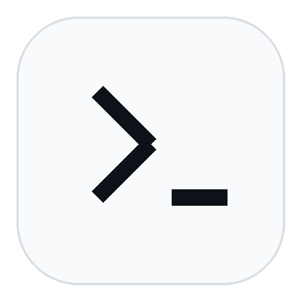
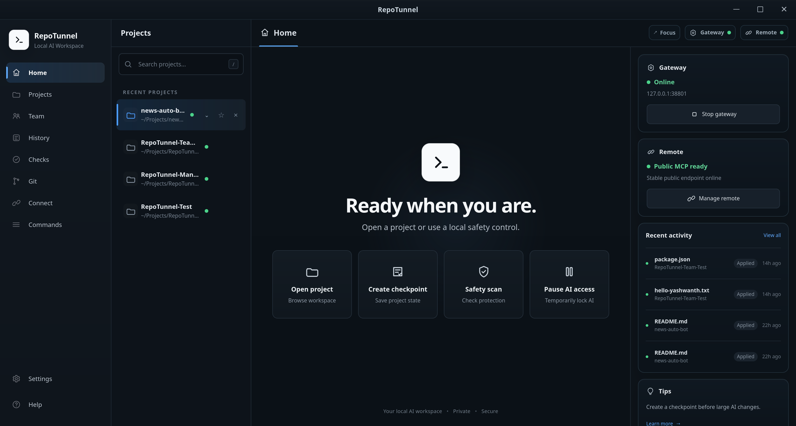

<div align="center">



# RepoTunnel

### Give AI access to the project you're working on  ###.

**RepoTunnel is a local-first desktop gateway for MCP-compatible AI clients.**

Connect ChatGPT or another supported client to explicitly approved projects, then let the AI inspect code, edit files, run tests, use Git, operate supported tools, and continue long-running work while RepoTunnel keeps the local security boundary under your control.

[](https://github.com/Yashwanth034/RepoTunnel/releases/tag/v0.4.1)
[](LICENSE)


[**Download RepoTunnel**](#download) · [**Get started**](#get-started) · [**Continuation extension**](#chatgpt-continuation-extension) · [**Security**](#security-by-design) · [**Documentation**](#documentation)

</div>

<p align="center">
  
</p>

---

## Why RepoTunnel

AI coding tools are useful when they can work with the real project — but handing an AI unrestricted filesystem, shell, browser, Git, device, or desktop access is a much bigger decision.

RepoTunnel puts a **permissioned local gateway** between the AI and your machine:

- **Explicit project access** — the AI works with approved workspaces, not arbitrary host paths.
- **Local-first control** — permissions, approvals, history, checkpoints, connection state, and device access stay in the desktop app.
- **Safe execution** — AI commands run through platform-specific sandboxing instead of silently falling back to unrestricted host execution.
- **Verifiable mutations** — edits, Git actions, browser actions, Phone actions, and long-running work expose state that can be reviewed and checked.
- **Human-owned publishing** — pushing Git history, publishing releases, uploading artifacts, and other external side effects still require an explicit user request.
- **Long-work continuity** — Project Memory, live resume state, durable processes, and the optional ChatGPT Continuation extension help work survive reconnects and long sessions.

## What RepoTunnel can do

| Area | What it provides |
| --- | --- |
| **Projects & code** | Approve or clone projects; browse, search, read, create, patch, rename, move, and delete within the workspace boundary. |
| **Large repositories** | Indexed inspection, paged directory/project views, resumable search cursors, and bounded high-offset text reads. |
| **Safe editing & history** | AI Auto / AI Review, pending diffs, version history, conservative undo/restore, checkpoints, activity history, and stale-change protection. |
| **Terminal & processes** | Disposable network-disabled verification sandboxes plus guarded real-workspace commands and durable managed processes. |
| **Git & GitHub** | Status, diff, log, validated staging, staged-only commits, safe restore, secret preflight, and use of RepoTunnel's connected GitHub credential without exposing it to the AI. |
| **Browser & desktop** | Managed Chromium automation, screenshots, network/console diagnostics, semantic actions, desktop control, and isolated AI Workspace sessions. |
| **Android Phone** | Wireless Debugging with USB fallback, live scrcpy control, apps/files/APKs/settings/logs/network tools, and optional semantic Phone Helper integration. |
| **Team Mode** | Two persistent AI engineers with task ownership, non-overlapping path claims, parallel implementation, cross-review, and evidence-based completion. |
| **Video** | Video Intelligence plus durable Video Production projects with scripts, scenes, narration, subtitles, rendering, preview, QA, and asset provenance. |
| **Continuity** | Continuity / Resume v2, Project Memory, factual recovery state, and exact-chat continuation through the optional Chromium extension. |

## Get started

### 1. Install RepoTunnel

Download the package for your operating system from the [latest release](https://github.com/Yashwanth034/RepoTunnel/releases/latest), then open RepoTunnel.

### 2. Approve a project

Add or clone a project and choose its local access mode:

- **Read only** — inspection only.
- **Read / write** — mutations are allowed through RepoTunnel's policy layer.

Then choose how AI changes should behave:

- **AI Review** — supported mutations wait for local approval.
- **AI Auto** — supported mutations can apply automatically while workspace, secret, sandbox, Phone, browser, and publish boundaries remain enforced.

### 3. Connect your AI client

RepoTunnel keeps the raw MCP gateway on loopback and provides supported remote connection paths:

| Connection | Use case |
| --- | --- |
| **ngrok** | Easiest managed public HTTPS path; uses your ngrok account/token. |
| **Cloudflare Tunnel** | Use an existing Cloudflare tunnel and `cloudflared`. |
| **Direct HTTPS** | Advanced self-routed TLS/ACME path without a relay provider. |
| **OpenAI Secure MCP Tunnel** | Optional integration for environments using OpenAI's tunnel client. |

Public MCP access uses RepoTunnel's OAuth boundary where applicable, including DCR/PKCE support.

### 4. Add RepoTunnel to ChatGPT

In ChatGPT's current custom-app / Developer Mode flow:

1. Create a custom MCP app.
2. Enter the HTTPS MCP endpoint shown by RepoTunnel.
3. Choose OAuth when using RepoTunnel's public OAuth path.
4. Complete authorization.
5. Refresh or rescan tools when the RepoTunnel MCP schema changes.
6. Verify the connection with a real RepoTunnel tool call such as listing approved workspaces.

> ChatGPT app availability and exact UI steps can vary by plan/workspace and may change independently of RepoTunnel.

## ChatGPT Continuation Extension

RepoTunnel includes an optional Chromium companion at:

```text
extensions/chatgpt-continuation/
```

It binds only the **exact ChatGPT conversations you explicitly save**. When RepoTunnel has a continuation checkpoint for that conversation, the extension waits for an idle, completed response and an empty composer before delivering the exact checkpoint.

Safety behavior includes:

- no guessed conversation targeting
- no overwriting text already typed by the user
- protection against recent human composer input
- prepare → authorize → one-send → acknowledge delivery
- uncertain post-send outcomes are **not automatically replayed**

### Install the extension

1. Open `chrome://extensions` in Chrome/Chromium or a compatible Chromium browser.
2. Enable **Developer mode**.
3. Choose **Load unpacked**.
4. Select `extensions/chatgpt-continuation`.
5. Open the ChatGPT conversation you want RepoTunnel to resume.
6. Open **RepoTunnel Continuation** and choose **Add current ChatGPT chat**.

The extension source is available on `main`. It is not a separate asset in the already-published v0.4.1 desktop release.

[Extension guide](extensions/chatgpt-continuation/README.md) · [Privacy](extensions/chatgpt-continuation/PRIVACY.md)

## Android Phone Access

RepoTunnel can maintain a user-selected Android device connection with **Wireless Debugging preferred** and authorized USB fallback for the same device.

The Phone surface supports:

- **Off / Limited / Full** AI access plus a separate **Pause AI**
- persistent live video and human control using the bundled scrcpy 4.1 server
- guarded AI screen/touch/typing actions
- app management, bounded files, APK install/remove, settings, shell, logs, and network diagnostics
- short-lived semantic refs and bounded semantic transactions through the bundled **RepoTunnel Phone Helper**

The helper is bundled with RepoTunnel; it is not a separate general-purpose Android app. Android Accessibility remains user-controlled and must be enabled by the user.

When a payment-sensitive app is foreground, RepoTunnel blocks AI observation/control paths rather than trying to bypass the application's security model.

[Phone Access details](docs/phone-access.md)

## Browser, Desktop & AI Workspace

RepoTunnel's browser layer uses isolated/persistent Chromium-family profiles and returns document-aware navigation/action state.

State-changing browser and semantic actions use bounded mutation receipts. If helper transport is lost after a mutation may already have happened, RepoTunnel reports the outcome as **ambiguous** and does not blindly replay the action.

Desktop control requires explicit local permission and blocks AI control of RepoTunnel itself. **AI Workspace** provides an isolated virtual desktop for supported GUI workflows so AI-owned application sessions do not need to take over the user's normal desktop.

## Team Mode

Team Mode keeps two AI engineers attached to one approved project.

The coordination model enforces:

- planning before implementation
- distinct task ownership
- non-overlapping path claims
- parallel work where safe
- cross-review by the other engineer
- evidence-based success criteria
- persistent teams across multiple user requests until the user explicitly ends the team

[Team Mode details](docs/team-mode.md)

## Video Intelligence & Production

RepoTunnel can analyze supported public or approved local media and can maintain durable Video Production projects.

Production workflows can include script/storyboard state, generated scenes, narration, subtitles, timeline/render jobs, preview, QA, cleanup, and license/provenance records. Tutorial/explainer scenes can use deterministic HTML/CSS/GSAP capture; story workflows can route suitable work through native motion or optional installed creative engines.

[Video details](docs/video.md)

## Security by design

RepoTunnel is designed as a **controlled local gateway**, not as unrestricted remote desktop or host shell access.

| Boundary | Behavior |
| --- | --- |
| **Workspace** | AI-facing file operations use workspace IDs + relative paths; traversal, protected credential files, and unsafe symlink escapes are rejected. |
| **Commands** | AI execution fails closed through Bubblewrap on Linux, AppContainer + Job Object isolation on Windows, or the current macOS Seatbelt compatibility backend. |
| **Review** | Remote MCP calls cannot approve/reject/undo their own locally queued Review actions. |
| **Git** | Staging/commits are validated and secret-scanned; push requires a current explicit human publishing instruction. |
| **Browser** | Sensitive semantic fields, stale refs, and uncertain mutations are guarded; ambiguous state-changing actions are not auto-replayed. |
| **Phone** | MCP cannot pair/select a phone, raise access, change capability grants, or unpause Phone Access. |
| **Network** | The raw MCP gateway remains loopback-only; public connection paths sit behind RepoTunnel's authenticated boundary. |
| **Secrets** | Protected paths and credential-like output are filtered/redacted across the relevant RepoTunnel surfaces. |

RepoTunnel does not attempt to bypass operating-system, Android, browser, application, or external-service security policies.

[Technical security model](docs/security.md) · [Security policy](SECURITY.md)

## Download

**Current public release: [RepoTunnel v0.4.1](https://github.com/Yashwanth034/RepoTunnel/releases/tag/v0.4.1)**

| Platform | Package |
| --- | --- |
| **Debian / Ubuntu / Linux Mint x64** | [`.deb`](https://github.com/Yashwanth034/RepoTunnel/releases/download/v0.4.1/RepoTunnel_0.4.1_amd64.deb) |
| **Fedora / RPM-based Linux x64** | [`.rpm`](https://github.com/Yashwanth034/RepoTunnel/releases/download/v0.4.1/RepoTunnel-0.4.1-1.x86_64.rpm) |
| **Other compatible Linux x64** | [`.AppImage`](https://github.com/Yashwanth034/RepoTunnel/releases/download/v0.4.1/RepoTunnel_0.4.1_amd64.AppImage) |
| **Windows x64** | [NSIS `.exe`](https://github.com/Yashwanth034/RepoTunnel/releases/download/v0.4.1/RepoTunnel_0.4.1_x64-setup.exe) · [`.msi`](https://github.com/Yashwanth034/RepoTunnel/releases/download/v0.4.1/RepoTunnel_0.4.1_x64_en-US.msi) |
| **macOS Apple Silicon** | [`aarch64.dmg`](https://github.com/Yashwanth034/RepoTunnel/releases/download/v0.4.1/RepoTunnel_0.4.1_aarch64.dmg) |
| **macOS Intel** | [`x64.dmg`](https://github.com/Yashwanth034/RepoTunnel/releases/download/v0.4.1/RepoTunnel_0.4.1_x64.dmg) |

The release also publishes updater signatures, signed updater archives, `latest.json`, and [SHA-256 checksums](https://github.com/Yashwanth034/RepoTunnel/releases/download/v0.4.1/RepoTunnel-SHA256SUMS.txt).

No RepoTunnel account is required.

### Platform status

RepoTunnel packages Linux, Windows, and both macOS architectures, but packaging does not imply identical native automation coverage.

- **Linux** is the primary live-validated development platform. Full managed-process reattachment after a complete RepoTunnel restart is currently Linux-only.
- **Windows** uses AppContainer + Job Object command isolation. Native UI Automation adapters exist and require native compatibility validation.
- **macOS** uses the current Seatbelt `sandbox-exec` compatibility backend. Update discovery is supported, but in-app update installation is intentionally disabled pending verified replacement/restore safety.
- **Android Phone Access** has been exercised on a real Android device; vendor/OS policy can still change capability availability.

## Architecture

```text
ChatGPT / MCP-compatible AI client
                  │
           HTTPS + OAuth
                  │
     ngrok / Cloudflare / Direct HTTPS
       / optional Secure MCP Tunnel
                  │
                  ▼
      RepoTunnel authenticated boundary
                  │
                  ▼
          loopback MCP gateway
                  │
                  ▼
      capability + policy router
          │       │       │
          │       │       ├── Browser / Desktop / AI Workspace
          │       │       ├── Android Phone
          │       │       ├── Video / Team / Continuity
          │       │
          │       └── Sandboxed commands / managed processes
          │
          └── Approved workspace
                ├── files + indexed search
                ├── safe editing + history
                └── Git / GitHub
```

RepoTunnel is built with **Tauri 2, Rust, React 19, and TypeScript**. Rust owns the privileged local boundary and MCP runtime; React/TypeScript provide the desktop interface.

## Development

```bash
git clone https://github.com/Yashwanth034/RepoTunnel.git
cd RepoTunnel
npm ci
npm run tauri dev
```

Useful checks:

```bash
npm run check
npm run test:frontend
npm run build
cargo check --manifest-path src-tauri/Cargo.toml
cargo test --manifest-path src-tauri/Cargo.toml --lib
```

Platform-specific Tauri/native dependencies are required to build the desktop application.

## Documentation

| Topic | Guide |
| --- | --- |
| Product scope & architecture | [Product](docs/product.md) · [Architecture](docs/architecture.md) |
| MCP contract & projects | [MCP tools](docs/mcp.md) · [Project indexing](docs/project-index.md) |
| Editing, commands & Git | [Safe editing](docs/safe-editing.md) · [Commands](docs/commands.md) · [Git](docs/git.md) |
| Browser & semantic safety | [Semantic Interaction Layer](SEMANTIC_INTERACTION_LAYER.md) |
| Continuity & recovery | [AI Continuity](AI_CONTINUITY.md) |
| Connections | [Remote MCP](docs/connection.md) · [Direct HTTPS](docs/direct-https.md) |
| Advanced workflows | [Team Mode](docs/team-mode.md) · [Phone](docs/phone-access.md) · [Video](docs/video.md) |
| Security & releases | [Security](docs/security.md) · [Release / Auto Update](docs/release.md) · [Acceptance](docs/acceptance.md) |

## Contributing

Issues, feature requests, and pull requests are welcome through [GitHub Issues](https://github.com/Yashwanth034/RepoTunnel/issues).

For security vulnerabilities, follow [SECURITY.md](SECURITY.md) and avoid posting secrets, private repository content, or personal filesystem paths in a public issue.

## License

Released under the [MIT License](LICENSE).

Copyright © 2026 Yashwanth.
